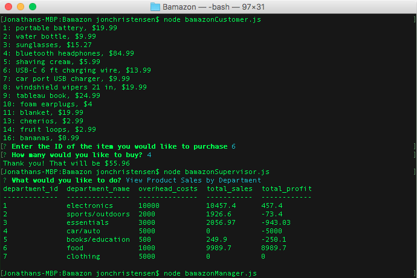

# Bamazon
Bamazon is a virtual store application accessed in the command line interface. It is run using Node.js and makes use of the Inquirer and MySQL modules.

## Description

Bamazon acts as an online store front located in the command line interface. It is made up of three different functions: customer, manager, and supervisor, each accessed by running their respective files using Node. Each file interacts with the local MySQL database representing the store inventory and accounts.

The customer file replicates the experience of buying from a store. The user is able to see the available items along with their price. They can then enter the items they would like to buy as well as how many. Upon successful purchase, they are shown the total price, and the number of items are subtracted from the stock number in the MySQL database. If there is not enough of that item in stock, the purchase is canceled.

The manager file allows the user to interact with the store at the managerial level. The user is able to see the current products for sale, view items with low inventory, add to the items inventory, and add a new product. Each option will modify the same database that the customer interacts with.

The supervisor file places the user in the role of a store supervisor above the managers. From there, they are able to view the overall sales by department, as well as add departments.

### Development

This application was developed as part of the GW Coding Bootcamp and was completed after the sixth week. Each function makes use of the inquirer and mysql node modules to create the user interface and connect to the database. It also makes sure of a MySQL server, database, and table.

### Organization

This repo can be cloned to your computer and accessed using the following command:

		git clone https://github.com/jonchr/LIRIbot.git
		cd LIRIbot

Before running one of the application files, you should set up the required tables in MySQL. This can be done with the command:

		node bamazonSchema.sql

After that, the user can run any of the three files of customer, manager, or supervisor. Note that the MySQL setup may need to be modified to run properly with your host, port, user, and password.

		(Any of the following commands)
		node bamazonCustomer.js
		node bamazonManager.js
		node bamazonSupervisor.js

## Screenshots
### Demonstration of the Customer and Supervisor experience
